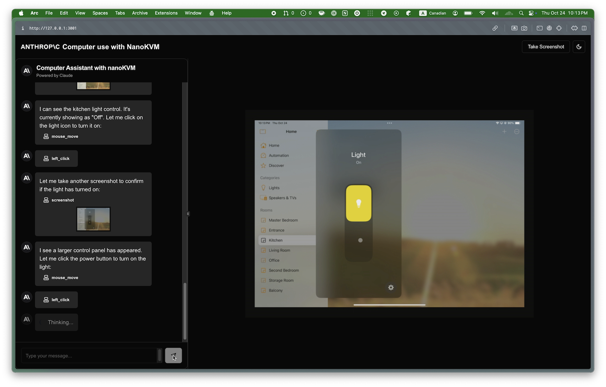

## Anthropic Computer Use demo with nanoKVM



Update your API key and nanoKVM IP address in the `.env.local` file. You need to follow sipeed's instructions to turn off authentication on the nanoKVM.

In order to run the demo, you need to change the resolution of the nanoKVM to 800x600. You can do this by using the nanoKVM's web interface.

Then you can run the following command to start the demo, and access it at [http://localhost:3000](http://localhost:3000).

```bash
bun dev
```

Enjoy!
